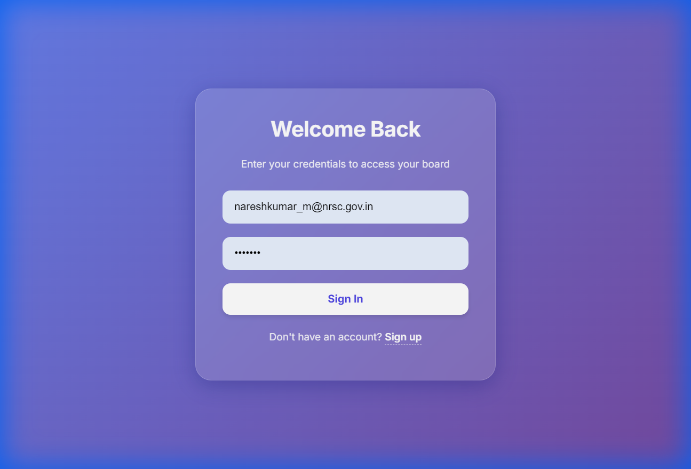
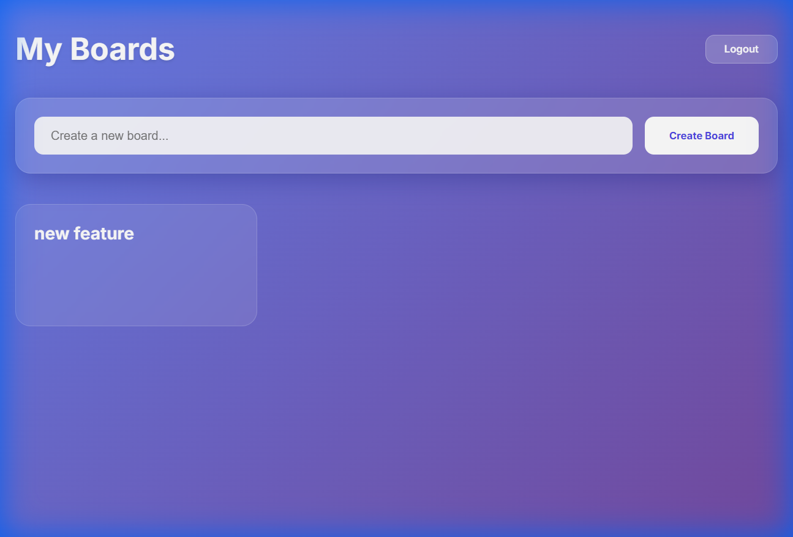
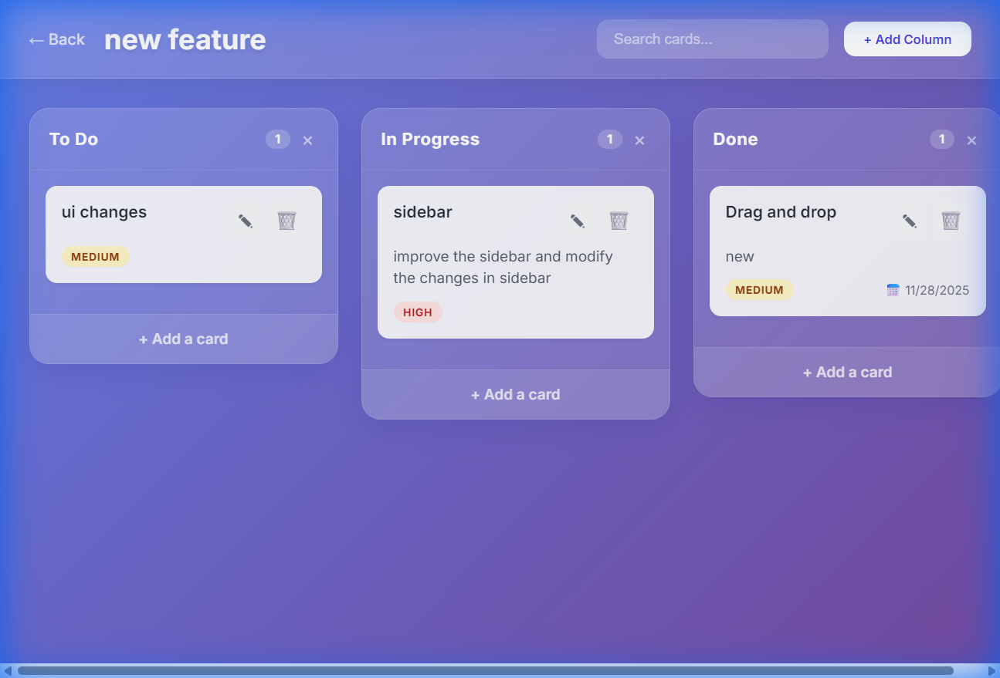

# Software Design Document (SDD)
## Project: TIB - Task & Idea Board

### 1. Introduction
This document describes the architecture and system design of the Task & Idea Board (TIB) application. It details the technology stack, database schema, API design, and user interface components.

### 2. System Architecture
TIB follows a standard **Client-Server Architecture**.

*   **Frontend (Client)**: Built with **React.js** and **Vite**. It handles user interactions, renders the UI, and communicates with the backend via RESTful APIs.
*   **Backend (Server)**: Built with **Node.js** and **Express**. It processes API requests, handles business logic, and interacts with the database.
*   **Database**: **PostgreSQL** is used for persistent data storage, managed via **Sequelize ORM**.

### 3. Data Design

#### 3.1 Database Schema
The database consists of four main relational tables:

1.  **Users**
    *   `id` (PK, Integer): Unique identifier.
    *   `email` (String, Unique): User's email address.
    *   `password_hash` (String): Bcrypt hashed password.
    *   `createdAt`, `updatedAt` (Timestamp).

2.  **Boards**
    *   `id` (PK, Integer).
    *   `title` (String).
    *   `userId` (FK, Integer): Links to the User who owns the board.
    *   *Associations*: Belongs to User, Has Many Columns.

3.  **Columns**
    *   `id` (PK, Integer).
    *   `title` (String).
    *   `position` (Float): Determines order on the board.
    *   `boardId` (FK, Integer): Links to the Board.
    *   *Associations*: Belongs to Board, Has Many Cards.

4.  **Cards**
    *   `id` (PK, Integer).
    *   `title` (String).
    *   `description` (Text).
    *   `priority` (Enum: 'Low', 'Medium', 'High').
    *   `dueDate` (Date).
    *   `position` (Float): Determines order within the column.
    *   `columnId` (FK, Integer): Links to the Column.
    *   *Associations*: Belongs to Column.

### 4. Component Design

#### 4.1 Frontend Components
*   **App.jsx**: Main entry point, handles routing (React Router) and Authentication Context.
*   **AuthContext.jsx**: Manages global user state (login/logout).
*   **Login.jsx / Signup.jsx**: Authentication forms with validation.
*   **Dashboard.jsx**: Displays list of boards and "Create Board" form.
*   **BoardView.jsx**: Main workspace. Fetches board data, renders columns, and handles drag-and-drop logic.
*   **Column.jsx**: Renders a list of cards and "Add Card" button.
*   **Card.jsx**: Draggable component displaying task details.
*   **Modal.jsx**: Reusable modal for creating/editing content.

#### 4.2 Backend Controllers
*   **authController.js**: Handles `signup` and `login`. Generates JWT tokens.
*   **boardController.js**: Handles `createBoard`, `getAllBoards`, `getBoardById`, `deleteBoard`.
*   **cardController.js**: Handles `createCard`, `updateCard`, `deleteCard`, `reorderCard`.

### 5. Interface Design
The User Interface is designed with a **Glassmorphism** aesthetic.

*   **Color Palette**: Deep Indigo/Purple gradients (`linear-gradient(135deg, #667eea 0%, #764ba2 100%)`).
*   **Elements**: Semi-transparent white backgrounds with `backdrop-filter: blur()`.
*   **Typography**: 'Inter' font family for clean, modern readability.
*   **Interactions**:
    *   Hover effects on cards and buttons.
    *   Smooth transitions for modal appearance.
    *   Visual cues during drag-and-drop (opacity changes).

### 6. User Interface Screenshots

#### 6.1 Login Page

#### 6.2 Dashboard

#### 6.3 Board View

